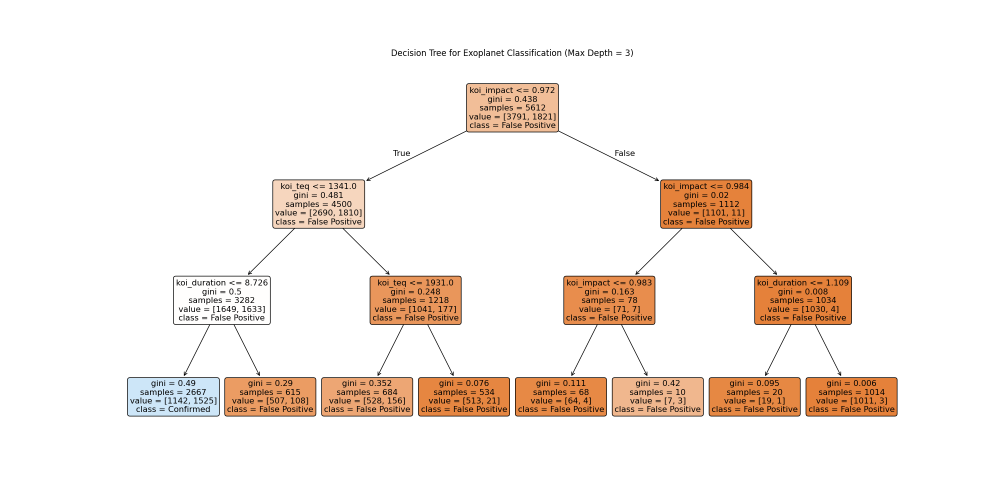
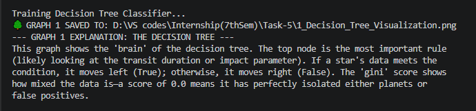
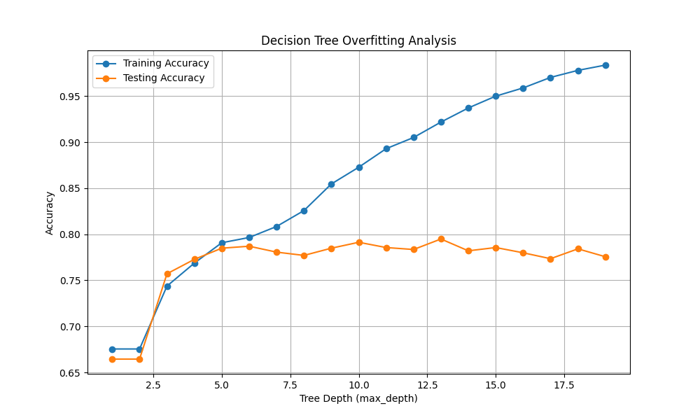
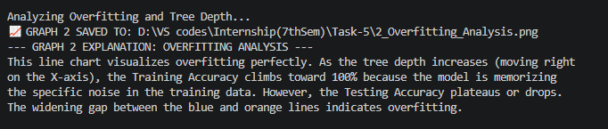
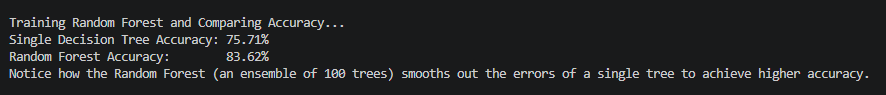
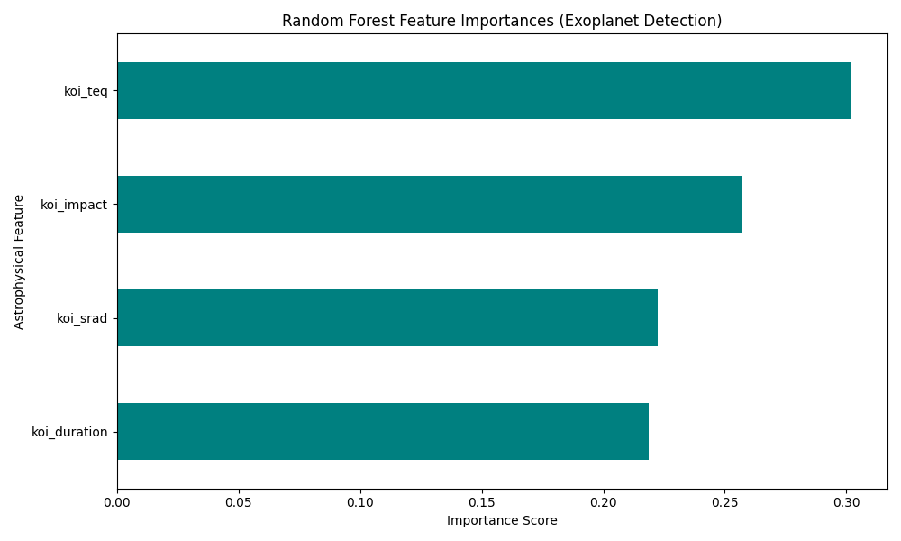
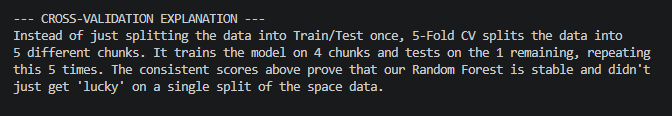
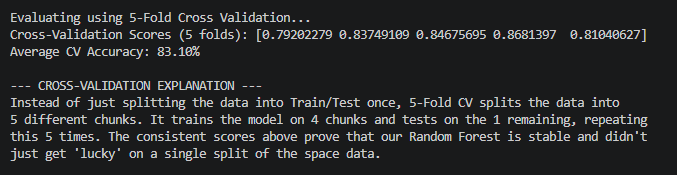

# 🪐 Astrophysics: Kepler Exoplanet Search: Tree-Based Models

## Objective
This project explores tree-based machine learning models (Decision Trees and Random Forests) to classify exoplanet candidates using deep-space telemetry data from NASA's Kepler Space Telescope. The goal is to accurately predict whether a star's light fluctuation is a 'Confirmed Exoplanet' (1) or a 'False Positive' (0) based on astrophysical features like Transit Duration, Stellar Radius, Impact Parameter, and Equilibrium Temperature.

---

## Technologies & Libraries Used
* **Python 3.x**
* **Pandas:** Data manipulation, cleaning, and feature selection.
* **Scikit-Learn (sklearn):** `DecisionTreeClassifier`, `RandomForestClassifier`, `cross_val_score` for K-Fold Cross Validation, and tree visualization tools.
* **Matplotlib:** Generating tree plots, overfitting line charts, and feature importance bar charts.

---

## Pipeline Steps & Key Insights

### 1. Model Logic & Decision Boundaries
A Decision Tree Classifier was fitted with a constrained maximum depth to mathematically isolate confirmed exoplanets from false positives without memorizing the noise inherent in space telemetry.

#### The Decision Tree Architecture
The diagram below maps out the raw physical thresholds used to split the celestial data. The top nodes represent the most critical conditions, systematically separating the star systems based on their mathematical properties.

#### Logic Verification & Terminal Output
Below is the training verification process and terminal logs explaining the tree's structural logic and Gini impurity metrics:

---

### 2. Complexity Tuning & Overfitting Analysis
To ensure the model generalizes to unseen star systems, the tree's depth was iteratively tested. Unconstrained trees naturally overfit to the continuous noise of the Kepler dataset, memorizing anomalies rather than learning true physics.

#### Training vs. Testing Accuracy Curves
The line chart below illustrates the divergence between training and testing performance as model complexity increases, highlighting the exact threshold where overfitting begins.

#### Convergence Properties & Terminal Output
Below are the terminal logs explaining the widening gap between the accuracy metrics and the implications for model depth constraints:

---

### 3. Ensemble Learning & Model Comparison
A Random Forest Classifier consisting of 100 aggregated decision trees was trained to smooth out the anomalies and jitter in the raw dataset, vastly improving classification accuracy over a single, brittle tree.

#### Accuracy Evaluation
Below is the terminal output comparing the ensemble model's accuracy against a single tree, demonstrating the power of bootstrap aggregating (bagging):

---

### 4. Interpreting Feature Importances
After training the ensemble model, it is crucial to understand which physical characteristics strongly influence the classification of a celestial body.

#### Astrophysical Feature Rankings
The bar chart below ranks the physical metrics by their predictive power. It mathematically demonstrates which properties are the strongest indicators of an actual orbiting exoplanet.

#### Predictive Power & Terminal Output
Below is the terminal output explaining the feature weights and their significance in the Random Forest's decision-making process:

---

### 5. Model Reliability & Validation
To guarantee that the Random Forest's high accuracy wasn't a byproduct of a lucky train-test split, rigorous K-Fold cross-validation was applied across the entire celestial dataset.

#### 5-Fold Cross-Validation Metrics
Below are the terminal logs confirming the model's stability and average performance across 5 distinct data subsets:

